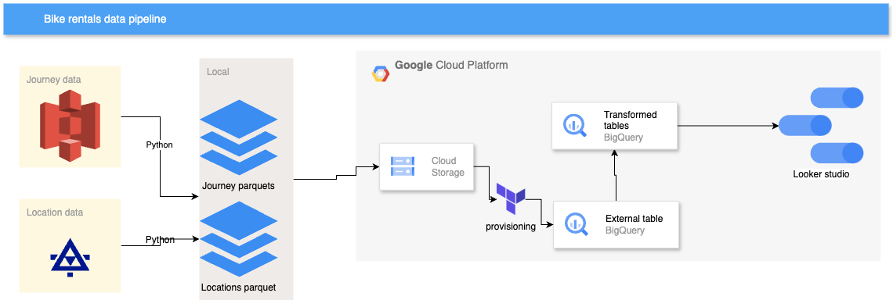
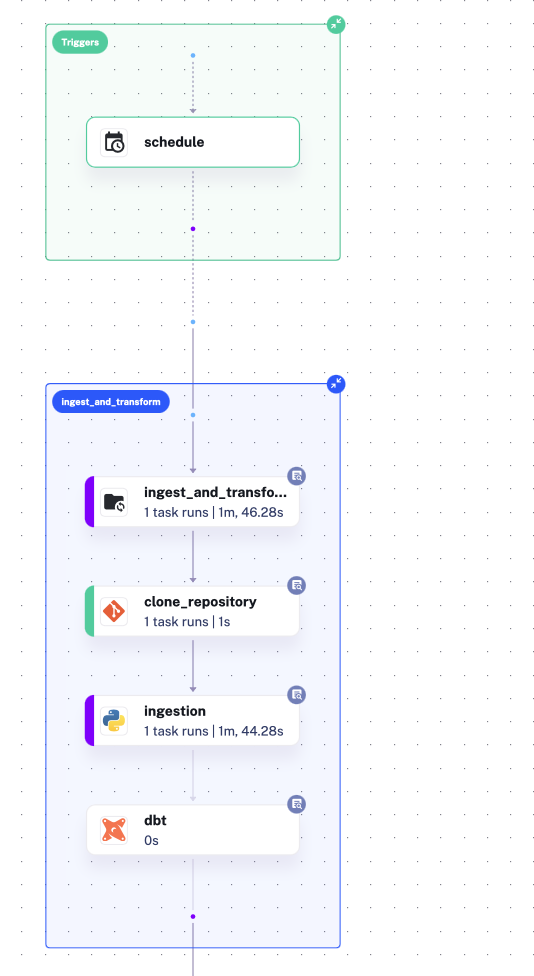
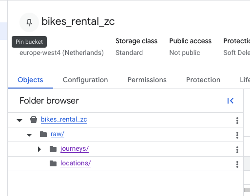
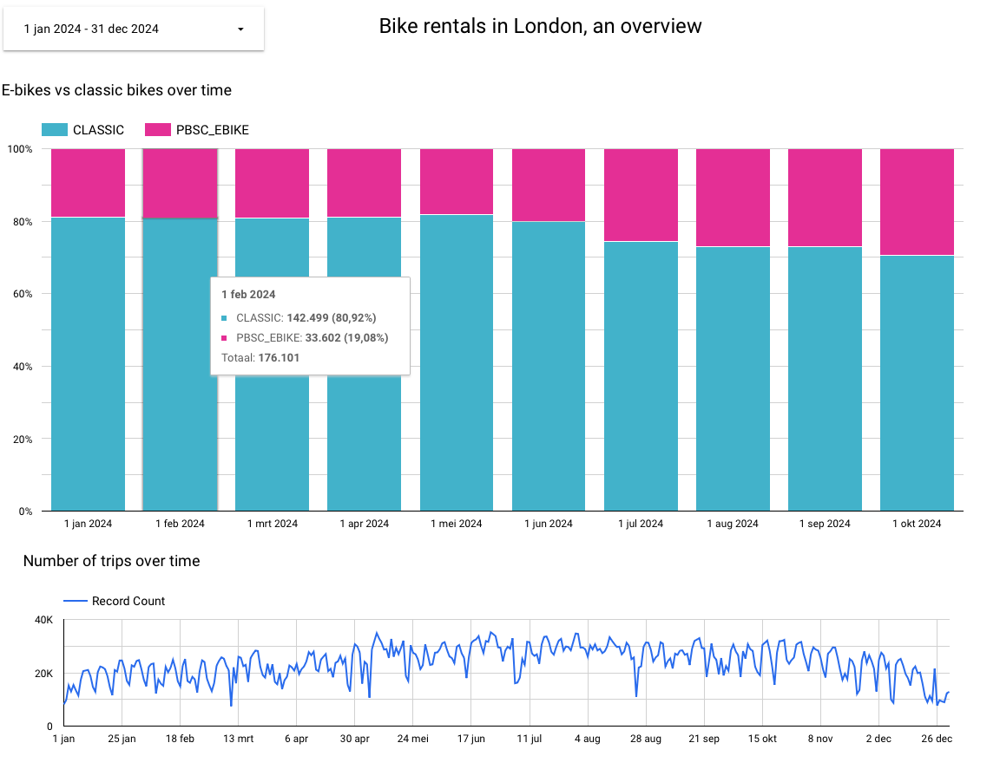
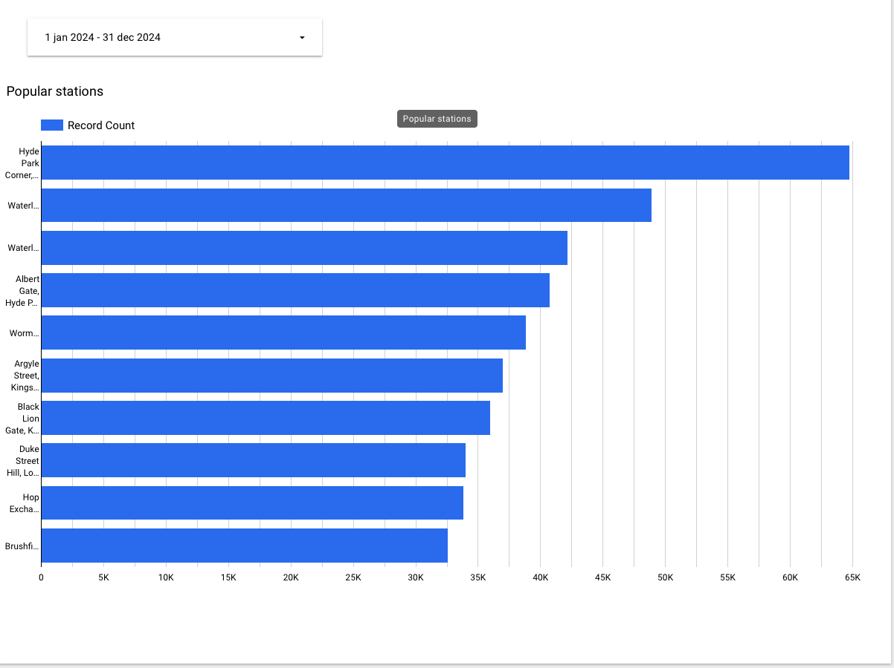

# de_zoomcamp_2025_project
Data pipeline for the data engineering zoomcamp project

- [de\_zoomcamp\_2025\_project](#de_zoomcamp_2025_project)
  - [Problem description](#problem-description)
  - [Technologies used](#technologies-used)
    - [Architecture overview:](#architecture-overview)
    - [Terraform](#terraform)
    - [GCP](#gcp)
    - [DBT](#dbt)
    - [Kestra](#kestra)
  - [Datasets used](#datasets-used)
  - [Setup](#setup)
    - [GCP setup](#gcp-setup)
    - [If you want to run the scripts separately](#if-you-want-to-run-the-scripts-separately)
    - [Run everything via kestra](#run-everything-via-kestra)
  - [Running the pipeline](#running-the-pipeline)
      - [Running all parts separately](#running-all-parts-separately)
      - [Running the flow in kestra](#running-the-flow-in-kestra)
  - [Next steps and improvements](#next-steps-and-improvements)

## Problem description

This project sets up a datapipeline to analyse London bike rentals.

We used the open [dataset](https://cycling.data.tfl.gov.uk/) which is provided by TfL (Transport London) under a permissive [license](https://tfl.gov.uk/corporate/terms-and-conditions/transport-data-service)

Bike journey data is enriched with bike rental locations data to provide insights into the following:

- Electrical bikes rise
- Popular stations
- Seasonal patterns
- Distance and duration of rides

## Technologies used

### Architecture overview:

- a [python script](ingest.py) is used to ingest data from S3 and an XML feed to GCS. An optional date can be given to limit the files loaded.
- [dbt](/bike_rentals/) is used to transform the data in bigquery
- [looker studio](https://lookerstudio.google.com/reporting/fd3e4b28-a73f-4fdf-b12e-177f75b2c0f7) is used for the dashboard

### Terraform

We used [terraform](main.tf) as IAC to set up the 

- GCS bucket
- Bigquery dataset
- external tables for the raw source data.
  
The external journey table is partitioned according to the hive-style partitioning of the source data in the bucket.

### GCP

- GCS: The TFL journey and bike point data is first saved as parquets to a google cloud storage bucket
- BigQuery: Bigquery is used as the datawarehouse
- Looker Studio: The final dashboard is made in looker studio.

### DBT

DBT is used to structure the data transformations in BigQuery. 

The DBT project, including setup and partitioning of tables is explained more [here](./bike_rentals/README.md)

### Kestra

The whole data pipeline from ingestion to transformations is orchestrated via Kestra.

  
First the repository is cloned, then the python ingestion task runs and lastly the dbt project is built creating the transformed tables.

The [flow](flows/dbt_bq_flow.yml) is scheduled with a monthly trigger.

## Datasets used

We used the open [dataset](https://cycling.data.tfl.gov.uk/) which is provided by TfL (Transport London) under a permissive [license](https://tfl.gov.uk/corporate/terms-and-conditions/transport-data-service)

More in detail, we used the journey data which can be found under the `usage-stats` prefix in the public s3 bucket `s3://cycling.data.tfl.gov.uk`.
Secondly, the [live feed data](https://tfl.gov.uk/tfl/syndication/feeds/cycle-hire/livecyclehireupdates.xml) of bike locations is ingested to enrich and complete the journey data.

## Setup

Disclaimer: tested on MAC, not Windows.

> [!TIP]
> It is important to set the right environment variables. 
> An `.env_template` is provided for this. You need to rename this to `.env` and fill with your own variables.\
> Some of those can be filled after setting up the service account.
> You can load the environment variables by running `source .env` in the command line.

To start: Clone this repository `git clone https://github.com/klimantje/de_zoomcamp_2025_project.git`

### GCP setup

- Create a GCP project and service account:
  - The service account must have google cloud storage and bigquery permissions
- Make sure you store the service account json locally, e.g. `.creds/gcp_creds.json`
- This is also the location that goes into the `GOOGLE_APPLICATION_CREDENTIALS` parameter in `.env`
- Install [terraform](https://developer.hashicorp.com/terraform/install)
- Create the bucket, bigquery dataset and external table for the source data with `terraform apply`

In the terraform file, make sure to replace with your own bucket and 

Alternatively, you can do the above manually in your GCP console.

### If you want to run the scripts separately

- Create a virtual environment `python -m venv --clear .venv` (or similar on your machine)
- Activate and install dependencies `source .venv/bin/activate` & `pip install -r requirements.txt`
- Alternatively, if you prefer running this in a docker container or via VSCode devcontainer, use the included `devcontainer.json`
- Make sure environment variables are set: fill the `.env_template` and rename to `.env`. Then `source .env` will set the environment variables. 

### Run everything via kestra

Kestra needs access to the environment variables as well. Therefore we also set `GOOGLE_APPLICATION_CREDENTIALS`  and other variables in the [docker compose](compose.yml)

Make sure the volume mapping refers to your local credential folder if you put that somewhere else than `.creds/gcp_creds.json`

To read more on environment variables and docker compose, see [this](https://docs.docker.com/compose/how-tos/environment-variables/set-environment-variables/)

Run `docker-compose --env-file .env up`

## Running the pipeline

#### Running all parts separately

When running manually, there are the following steps:

Perform these in the root of this git repo on your machine:- 

- `python ingest.py` will clean and process the files and upload to gcs in a partitioned way (by file modified day)
  

- `cd bike_rentals` brings you to the dbt project
- `dbt run` will run the dbt transformations
- `dbt run --full-refresh` will run non incrementally
- `dbt docs generate` && `dbt docs serve` will show you the documentation and tests defined.

The looker dashboard is available [here](https://lookerstudio.google.com/reporting/fd3e4b28-a73f-4fdf-b12e-177f75b2c0f7)

#### Running the flow in kestra

The pipeline is orchestrated through kestra. 

Start kestra by `docker compose up`.

Import the [flow](flows/dbt_bq_flow.yml)

The flow is scheduled to be triggered monthly and will by default only load data from since last trigger.

To load all the data, use the [backfill](https://kestra.io/docs/concepts/backfill) option in kestra.

## Next steps and improvements

- Currently the pipeline, although using mostly GCP is running from local. 
  - It would be good to deploy this to a Cloud VM.
  - Something like transferservice can be used to transfer the raw files to GCS and perform all the processing there.
- Several parts can be refactored:
  - The way we set up kestra 
  - Usage of more variables, less hardcoding
- The bike data can be further enriched with e.g. weather data to provide better insights.
- There is also still a lot of other data feeds available on TFL which can be used to extend the pipeline.
- The bike location data is actually streaming, but now only used to periodically update the bike locations.

