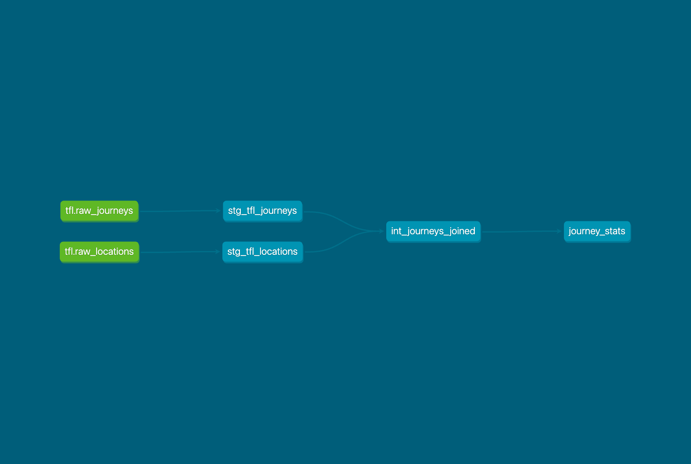

Welcome to the bike rentals dbt project!

In this dbt project we ingest and transform bike journeys from London and enrich them with bike rental location data.

## DBT project structure

We took a layered approach according to dbt best practices.

- Sources: two external bigquery tables, one for journeys and one for locations
- Staging layer: Both sources are cleaned, fields are casted and renamed
- Intermediate layer: Journeys and locations are joined to create one big table
- Marts: We create a table of journey statistics per month

Also, staging and intermediate tables for journeys are:

- incremental to avoid recalculating the full table every time.
- partitioned by ride_started timestamp (by day) as this is a dimension we will often filter on.

The documentation is published [here](https://klimantje.github.io/de_zoomcamp_2025_project/)

### To run this dbt project

The following commands are useful:

- `dbt run` to create the tables
- `dbt test` to run the tests
- `dbt docs generate` & `dbt docs serve` to see the documentation

### Resources:
- Learn more about dbt [in the docs](https://docs.getdbt.com/docs/introduction)
- Check out [Discourse](https://discourse.getdbt.com/) for commonly asked questions and answers
- Join the [chat](https://community.getdbt.com/) on Slack for live discussions and support
- Find [dbt events](https://events.getdbt.com) near you
- Check out [the blog](https://blog.getdbt.com/) for the latest news on dbt's development and best practices
